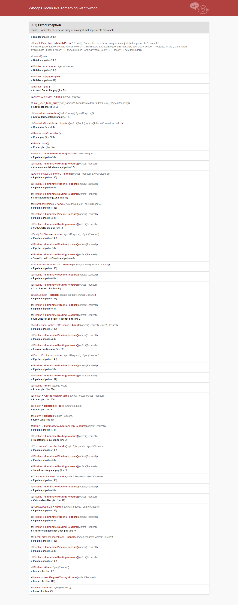

# Errores y soluciones

## count(): Parameter must be an array or an object that implements Countable
### Error
I'm facing strange case. I face an error in production env not while in dev it's working fine.

Development: Laravel 5.4.28 PHP 7.0.13 MYSQL 5.7.17

Production: Laravel 5.4.28 PHP 7.2.1 MYSQL 5.7.20

In implementation code. I used:

```
namespace App;
use Illuminate\Support\Facades\Storage;
use Laravel\Scout\Searchable;
use Illuminate\Database\Eloquent\Model;

class Artwork extends Model
{
  use Searchable;
```

In development it works fine. But in production it gives me this error: count(): Parameter must be an array or an object that implements Countable in Builder.php (line 936)

as you can see in this pic:



Any idea what is the reason behind this? and how to fix?

### Solucion
Put this code at the beginning of your route file, it will work fine
```
if(version_compare(PHP_VERSION, '7.2.0', '>=')) {
    error_reporting(E_ALL ^ E_NOTICE ^ E_WARNING);
}
```